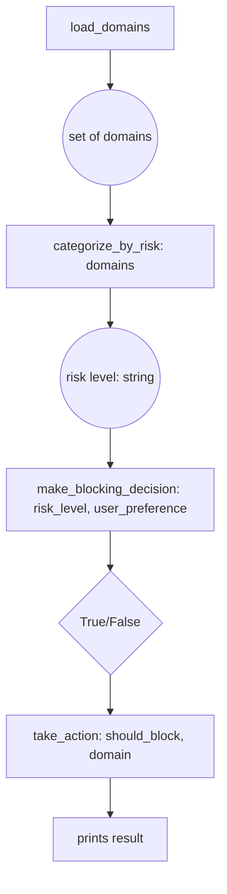

# CSCI 1250 Lab 3: Email Security Manager
## Functions Working Together & Introduction to Sets

## Learning Objectives
By the end of this lab, you will be able to:
- **Chain functions together** to solve complex problems step-by-step
- **Understand** how return values from one function become parameters for another
- **Create and manipulate** Python sets for organizing data
- **Apply set operations** (union, intersection, difference) to solve real problems
- **Use Boolean logic** to make decisions in your programs
- **Design algorithms** that combine multiple functions in sequence

---

## Introduction: The Email Security Challenge

You're working for ETSU's IT department, and they need help managing email security. Spam domains are constantly changing, and the team needs a system to:
- Organize domains by threat level
- Combine multiple threat lists
- Check if incoming emails should be blocked
- Generate security reports

Today, you'll build this system step by step, learning how functions work together like stations in an assembly line, and how **sets** help us organize and compare groups of data efficiently.

---

# Part 1: Understanding Function Chains (20 minutes)

## Concept: The Assembly Line Approach

Think of functions like stations in a factory assembly line. Each station:
1. **Receives input** (raw materials or partially finished products)
2. **Does one specific job** (adds, modifies, or processes)
3. **Passes output** to the next station (finished or improved product)

### Visual Flow for Our Email Security System:


### Activity 1A: Simple Function Chain
Create a new file: `function_chain_practice.py`

```python
def get_domain():
    """Station 1: Get input from user"""
    return input("Enter a domain to check: ").strip().lower()

def assess_risk(domain):
    """Station 2: Analyze domain for risk indicators"""
    suspicious_keywords = ["hack", "cyber", "spam", "malware"]
    
    for keyword in suspicious_keywords:
        if keyword in domain:
            return "HIGH"
    
    if domain.endswith(".com"):
        return "MEDIUM"
    else:
        return "LOW"

def recommend_action(risk_level):
    """Station 3: Decide what to do based on risk"""
    if risk_level == "HIGH":
        return "BLOCK"
    elif risk_level == "MEDIUM":
        return "REVIEW"
    else:
        return "ALLOW"

def display_result(domain, risk_level, action):
    """Station 4: Show the final decision"""
    print(f"\n=== Security Analysis ===")
    print(f"Domain: {domain}")
    print(f"Risk Level: {risk_level}")
    print(f"Recommended Action: {action}")

def main():
    """Orchestrate all the stations working together"""
    # TODO: Call the functions in sequence, passing outputs as inputs
    
    # Step 1: Get the domain (no input needed)
    domain = get_domain()
    
    # Step 2: Assess risk (needs the domain from step 1)
    risk = assess_risk(domain)
    
    # Step 3: Get recommendation (needs the risk from step 2)
    action = recommend_action(risk)
    
    # Step 4: Display results (needs domain, risk, and action)
    display_result(domain, risk, action)

main()
```

**Your Task**: Run this program and test it with:
- `hacknotice.com` (should be HIGH risk)
- `google.com` (should be MEDIUM risk)
- `university.edu` (should be LOW risk)

**Discussion Questions**:
1. What happens if you try to use `risk` in `main()` before calling `assess_risk()`?
2. Why do we store the return value from each function in a variable?
3. How is this like an assembly line?

---

# Part 2: Introduction to Sets (30 minutes)

## What Are Sets?

A **set** is a collection of unique items with no duplicates and no specific order. Think of it like:
- A bag of unique marbles (no two identical marbles)
- A guest list (each person listed only once)
- A collection of email domains (each domain appears only once)

### Creating Sets in Python

```python
# Method 1: Using curly braces
high_risk_domains = {"hacknotice.com", "malware-site.org", "spam123.net"}

# Method 2: Using set() function
medium_risk_domains = set(["google.com", "microsoft.com", "salesforce.com"])

# Method 3: Converting from a list (removes duplicates automatically)
mixed_list = ["apple.com", "google.com", "apple.com", "yahoo.com"]
unique_domains = set(mixed_list)  # {'apple.com', 'google.com', 'yahoo.com'}
```

### Basic Set Operations

```python
# Check if an item is in a set
if "google.com" in high_risk_domains:
    print("Google is high risk!")  # This won't print

# Add items
high_risk_domains.add("new-threat.com")

# Remove items
high_risk_domains.remove("spam123.net")  # Error if not found
high_risk_domains.discard("maybe-not-there.com")  # Safe removal

# Get the size
print(f"We're blocking {len(high_risk_domains)} high-risk domains")
```

### Activity 2A: Basic Set Practice
Create a new file: `set_basics.py`

```python
def create_domain_sets():
    """Create our initial security lists"""
    # High-risk domains (known malicious)
    high_risk = {
        "hacknotice.com",
        "cyberdefense.com", 
        "malware-hub.org",
        "spam-central.net"
    }
    
    # Medium-risk domains (marketing/sales)
    medium_risk = {
        "alteryx.com",
        "druva.com", 
        "salesforce.com",
        "marketing-blast.com"
    }
    
    # Trusted domains (should never be blocked)
    trusted = {
        "etsu.edu",
        "google.com",
        "microsoft.com",
        "github.com"
    }
    
    return high_risk, medium_risk, trusted

def check_domain_status(domain, high_risk, medium_risk, trusted):
    """Determine what category a domain falls into"""
    if domain in high_risk:
        return "HIGH RISK - BLOCK IMMEDIATELY"
    elif domain in medium_risk:
        return "MEDIUM RISK - REVIEW REQUIRED"
    elif domain in trusted:
        return "TRUSTED - ALWAYS ALLOW"
    else:
        return "UNKNOWN - NEEDS INVESTIGATION"

def main():
    """Test our domain classification system"""
    high, medium, trusted = create_domain_sets()
    
    # Test domains
    test_domains = ["hacknotice.com", "etsu.edu", "unknown-site.org", "druva.com"]
    
    print("=== Domain Security Check ===")
    for domain in test_domains:
        status = check_domain_status(domain, high, medium, trusted)
        print(f"{domain}: {status}")

main()
```

**Your Task**: 
1. Run the program and observe the output
2. Add your own test domain to `test_domains` and see what happens
3. Add a new domain to one of the risk categories and test again

---

# Part 3: Set Relationships and Operations (40 minutes)

## Set Operations: The Power of Comparison

Just like we can do math with numbers (`5 + 3`), we can do operations with sets to answer important questions:

### 1. Union (Combining Sets) - The `|` operator or `.union()`

**Real-world question**: "What domains should we block if we combine two different threat lists?"

```python
list_a = {"threat1.com", "spam.net", "bad-site.org"}
list_b = {"malware.net", "spam.net", "phishing.com"}

# Union: All unique domains from both lists
all_threats = list_a | list_b
# Result: {"threat1.com", "spam.net", "bad-site.org", "malware.net", "phishing.com"}
```

**Visual Representation**:
```
List A: [threat1.com, spam.net, bad-site.org]
List B: [malware.net, spam.net, phishing.com]
Union:  [threat1.com, spam.net, bad-site.org, malware.net, phishing.com]
        ↑ All unique domains from both lists
```

### 2. Intersection (Common Elements) - The `&` operator or `.intersection()`

**Real-world question**: "Which domains appear on multiple threat lists?" (High confidence threats)

```python
industry_threats = {"spam.net", "phishing.com", "malware.net"}
company_blocks = {"spam.net", "bad-ads.com", "malware.net"}

# Intersection: Domains that appear in BOTH lists
confirmed_threats = industry_threats & company_blocks
# Result: {"spam.net", "malware.net"}
```

**Visual Representation**:
```
Industry: [spam.net, phishing.com, malware.net]
Company:  [spam.net, bad-ads.com, malware.net]
Common:   [spam.net, malware.net]
          ↑ Only domains in both lists
```

### 3. Difference (What's Unique) - The `-` operator or `.difference()`

**Real-world question**: "What new threats have we discovered that aren't in our current blocklist?"

```python
latest_threats = {"new-malware.com", "spam.net", "fresh-phish.org"}
current_blocks = {"spam.net", "old-threat.com"}

# Difference: What's in latest_threats but NOT in current_blocks
new_discoveries = latest_threats - current_blocks
# Result: {"new-malware.com", "fresh-phish.org"}
```

**Visual Representation**:
```
Latest:   [new-malware.com, spam.net, fresh-phish.org]
Current:  [spam.net, old-threat.com]
New:      [new-malware.com, fresh-phish.org]
          ↑ In latest but not in current
```

### 4. Subset Checking - The `<=` operator or `.issubset()`

**Real-world question**: "Does our company blocklist cover all the industry-recommended threats?"

```python
industry_minimum = {"critical-threat.com", "known-bad.net"}
our_blocklist = {"critical-threat.com", "known-bad.net", "extra-protection.org"}

# Check if industry_minimum is completely covered by our_blocklist
is_compliant = industry_minimum <= our_blocklist
# Result: True (we block everything they recommend, plus more)
```

### Activity 3A: Set Operations Practice
Create a new file: `set_operations.py`

```python
def load_threat_intelligence():
    """Load different threat intelligence sources"""
    
    # FBI's high-priority threat list
    fbi_threats = {
        "nation-state-actor.ru",
        "ransomware-gang.onion", 
        "credential-stealer.net",
        "banking-trojan.org"
    }
    
    # Commercial security vendor's list
    vendor_threats = {
        "credential-stealer.net",
        "spam-factory.com",
        "ad-fraud-network.biz",
        "banking-trojan.org",
        "fake-update.download"
    }
    
    # Our company's current blocklist
    company_blocks = {
        "spam-factory.com",
        "old-malware.defunct",
        "legacy-threat.net"
    }
    
    return fbi_threats, vendor_threats, company_blocks

def analyze_threat_coverage(fbi, vendor, company):
    """Analyze our security coverage using set operations"""
    
    print("=== Threat Intelligence Analysis ===\n")
    
    # 1. Union: What would we block if we combined all sources?
    all_possible_blocks = fbi | vendor | company
    print(f"1. TOTAL UNIQUE THREATS across all sources: {len(all_possible_blocks)}")
    print(f"   Domains: {sorted(all_possible_blocks)}\n")
    
    # 2. Intersection: High-confidence threats (appear in multiple lists)
    high_confidence = fbi & vendor
    print(f"2. HIGH-CONFIDENCE THREATS (FBI + Vendor agree): {len(high_confidence)}")
    print(f"   Domains: {sorted(high_confidence)}\n")
    
    # 3. Difference: What are we missing?
    fbi_gaps = fbi - company
    vendor_gaps = vendor - company
    
    print(f"3. SECURITY GAPS:")
    print(f"   FBI threats we don't block: {sorted(fbi_gaps)}")
    print(f"   Vendor threats we don't block: {sorted(vendor_gaps)}\n")
    
    # 4. Subset checking: Are we compliant with FBI recommendations?
    fbi_compliant = fbi <= company
    print(f"4. COMPLIANCE CHECK:")
    print(f"   Do we block all FBI threats? {fbi_compliant}")
    
    if not fbi_compliant:
        print(f"   ❌ Missing critical FBI threats: {sorted(fbi - company)}")
    else:
        print(f"   ✅ Full FBI compliance achieved!")

def generate_recommendations(fbi, vendor, company):
    """Create actionable recommendations"""
    
    print(f"\n=== SECURITY RECOMMENDATIONS ===")
    
    # Critical additions (FBI threats we're missing)
    critical_adds = fbi - company
    if critical_adds:
        print(f"🚨 CRITICAL: Immediately add these FBI threats:")
        for domain in sorted(critical_adds):
            print(f"   - {domain}")
    
    # High-value additions (vendor threats with FBI overlap)
    high_value = (vendor & fbi) - company
    if high_value:
        print(f"⚠️  HIGH VALUE: Consider adding these confirmed threats:")
        for domain in sorted(high_value):
            print(f"   - {domain}")
    
    # Possible cleanup (our blocks not validated by others)
    potential_cleanup = company - (fbi | vendor)
    if potential_cleanup:
        print(f"🧹 REVIEW: These blocks aren't validated by current intelligence:")
        for domain in sorted(potential_cleanup):
            print(f"   - {domain} (verify still needed)")

def main():
    """Orchestrate the complete threat analysis"""
    # Step 1: Load all our data sources
    fbi_list, vendor_list, company_list = load_threat_intelligence()
    
    # Step 2: Analyze our current coverage
    analyze_threat_coverage(fbi_list, vendor_list, company_list)
    
    # Step 3: Generate actionable recommendations
    generate_recommendations(fbi_list, vendor_list, company_list)

main()
```

**Your Task**: 
1. Run the program and study the output carefully
2. Try adding a domain that appears in all three lists and see how the analysis changes
3. Modify the `company_blocks` set to include some FBI threats and observe the compliance check

**Discussion Questions**:
1. Why is the intersection of FBI and vendor lists considered "high-confidence"?
2. How does set difference help us identify security gaps?
3. What's the practical value of knowing subset relationships?

---

# Submission Requirements

Submit all your Python files with proper documentation:
- [ ] `function_chain_practice.py` - Basic function chaining
- [ ] `set_basics.py` - Introduction to sets
- [ ] `set_operations.py` - Set operations practice

**Code Requirements**:
- [ ] Variable names clearly indicate what data they contain
- [ ] Code demonstrates proper use of set operations
- [ ] Programs produce correct output for test cases

---

# Key Takeaways

Today you learned to:

## Function Chains
- **Functions work together** like stations in an assembly line
- **Return values** from one function become **parameters** for the next
- **Each function has one clear job** and produces output for the next step
- **Order matters** - you must call functions in the right sequence

## Sets and Set Operations
- **Sets store unique items** with no duplicates
- **Union** (`|`) combines sets - "everything from both"
- **Intersection** (`&`) finds common items - "what they share"
- **Difference** (`-`) finds unique items - "what's in A but not B"
- **Subset checking** (`<=`) verifies if one set is completely contained in another

## Boolean Logic in Practice
- **Conditions** can be combined with `and`, `or`, and `not`
- **Set membership** (`in`) returns True/False for decision making
- **Multiple criteria** can be evaluated together for complex decisions

## Algorithm Design
- **Break complex problems** into a sequence of simpler steps
- **Plan the data flow** - what each function needs and produces
- **Design reusable components** that can work together in different combinations

## Real-World Applications
- **Email security** requires combining multiple data sources
- **Risk assessment** uses scoring and threshold-based decisions
- **Automated systems** can make intelligent choices using Boolean logic
- **Data analysis** relies heavily on set operations to compare and combine datasets
