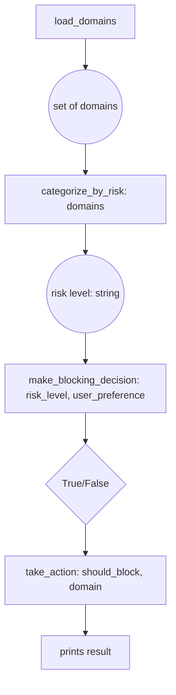

# CSCI 1250 Lab 3: Email Security Manager
## Functions Working Together & Introduction to Sets

## Learning Objectives
By the end of this lab, you will be able to:
- **Chain functions together** to solve complex problems step-by-step
- **Understand** how return values from one function become parameters for another
- **Create and manipulate** Python sets for organizing data
- **Apply set operations** (union, intersection, difference) to solve real problems
- **Use Boolean logic** to make decisions in your programs
- **Design algorithms** that combine multiple functions in sequence

---

## Introduction: The Email Security Challenge

You're working for ETSU's IT department, and they need help managing email security. Spam domains are constantly changing, and the team needs a system to:
- Organize domains by threat level
- Combine multiple threat lists
- Check if incoming emails should be blocked
- Generate security reports

Today, you'll build this system step by step, learning how functions work together like stations in an assembly line, and how **sets** help us organize and compare groups of data efficiently.

---

# Part 1: Understanding Function Chains (20 minutes)

## Concept: The Assembly Line Approach

Think of functions like stations in a factory assembly line. Each station:
1. **Receives input** (raw materials or partially finished products)
2. **Does one specific job** (adds, modifies, or processes)
3. **Passes output** to the next station (finished or improved product)

### Visual Flow for Our Email Security System:


### Activity 1A: Simple Function Chain
Create a new file: `function_chain_practice.py`

```python
def get_domain():
    """Station 1: Get input from user"""
    return input("Enter a domain to check: ").strip().lower()

def assess_risk(domain):
    """Station 2: Analyze domain for risk indicators"""
    suspicious_keywords = ["hack", "cyber", "spam", "malware"]
    
    for keyword in suspicious_keywords:
        if keyword in domain:
            return "HIGH"
    
    if domain.endswith(".com"):
        return "MEDIUM"
    else:
        return "LOW"

def recommend_action(risk_level):
    """Station 3: Decide what to do based on risk"""
    if risk_level == "HIGH":
        return "BLOCK"
    elif risk_level == "MEDIUM":
        return "REVIEW"
    else:
        return "ALLOW"

def display_result(domain, risk_level, action):
    """Station 4: Show the final decision"""
    print(f"\n=== Security Analysis ===")
    print(f"Domain: {domain}")
    print(f"Risk Level: {risk_level}")
    print(f"Recommended Action: {action}")

def main():
    """Orchestrate all the stations working together"""
    # TODO: Call the functions in sequence, passing outputs as inputs
    
    # Step 1: Get the domain (no input needed)
    domain = get_domain()
    
    # Step 2: Assess risk (needs the domain from step 1)
    risk = assess_risk(domain)
    
    # Step 3: Get recommendation (needs the risk from step 2)
    action = recommend_action(risk)
    
    # Step 4: Display results (needs domain, risk, and action)
    display_result(domain, risk, action)

if __name__ == "__main__":
    main()
```

**Your Task**: Run this program and test it with:
- `hacknotice.com` (should be HIGH risk)
- `google.com` (should be MEDIUM risk)
- `university.edu` (should be LOW risk)

**Discussion Questions**:
1. What happens if you try to use `risk` in `main()` before calling `assess_risk()`?
2. Why do we store the return value from each function in a variable?
3. How is this like an assembly line?

---

# Part 2: Introduction to Sets (30 minutes)

## What Are Sets?

A **set** is a collection of unique items with no duplicates and no specific order. Think of it like:
- A bag of unique marbles (no two identical marbles)
- A guest list (each person listed only once)
- A collection of email domains (each domain appears only once)

### Creating Sets in Python

```python
# Method 1: Using curly braces
high_risk_domains = {"hacknotice.com", "malware-site.org", "spam123.net"}

# Method 2: Using set() function
medium_risk_domains = set(["google.com", "microsoft.com", "salesforce.com"])

# Method 3: Converting from a list (removes duplicates automatically)
mixed_list = ["apple.com", "google.com", "apple.com", "yahoo.com"]
unique_domains = set(mixed_list)  # {'apple.com', 'google.com', 'yahoo.com'}
```

### Basic Set Operations

```python
# Check if an item is in a set
if "google.com" in high_risk_domains:
    print("Google is high risk!")  # This won't print

# Add items
high_risk_domains.add("new-threat.com")

# Remove items
high_risk_domains.remove("spam123.net")  # Error if not found
high_risk_domains.discard("maybe-not-there.com")  # Safe removal

# Get the size
print(f"We're blocking {len(high_risk_domains)} high-risk domains")
```

### Activity 2A: Basic Set Practice
Create a new file: `set_basics.py`

```python
def create_domain_sets():
    """Create our initial security lists"""
    # High-risk domains (known malicious)
    high_risk = {
        "hacknotice.com",
        "cyberdefense.com", 
        "malware-hub.org",
        "spam-central.net"
    }
    
    # Medium-risk domains (marketing/sales)
    medium_risk = {
        "alteryx.com",
        "druva.com", 
        "salesforce.com",
        "marketing-blast.com"
    }
    
    # Trusted domains (should never be blocked)
    trusted = {
        "etsu.edu",
        "google.com",
        "microsoft.com",
        "github.com"
    }
    
    return high_risk, medium_risk, trusted

def check_domain_status(domain, high_risk, medium_risk, trusted):
    """Determine what category a domain falls into"""
    if domain in high_risk:
        return "HIGH RISK - BLOCK IMMEDIATELY"
    elif domain in medium_risk:
        return "MEDIUM RISK - REVIEW REQUIRED"
    elif domain in trusted:
        return "TRUSTED - ALWAYS ALLOW"
    else:
        return "UNKNOWN - NEEDS INVESTIGATION"

def main():
    """Test our domain classification system"""
    high, medium, trusted = create_domain_sets()
    
    # Test domains
    test_domains = ["hacknotice.com", "etsu.edu", "unknown-site.org", "druva.com"]
    
    print("=== Domain Security Check ===")
    for domain in test_domains:
        status = check_domain_status(domain, high, medium, trusted)
        print(f"{domain}: {status}")

if __name__ == "__main__":
    main()
```

**Your Task**: 
1. Run the program and observe the output
2. Add your own test domain to `test_domains` and see what happens
3. Add a new domain to one of the risk categories and test again

---

# Part 3: Set Relationships and Operations (40 minutes)

## Set Operations: The Power of Comparison

Just like we can do math with numbers (`5 + 3`), we can do operations with sets to answer important questions:

### 1. Union (Combining Sets) - The `|` operator or `.union()`

**Real-world question**: "What domains should we block if we combine two different threat lists?"

```python
list_a = {"threat1.com", "spam.net", "bad-site.org"}
list_b = {"malware.net", "spam.net", "phishing.com"}

# Union: All unique domains from both lists
all_threats = list_a | list_b
# Result: {"threat1.com", "spam.net", "bad-site.org", "malware.net", "phishing.com"}
```

**Visual Representation**:
```
List A: [threat1.com, spam.net, bad-site.org]
List B: [malware.net, spam.net, phishing.com]
Union:  [threat1.com, spam.net, bad-site.org, malware.net, phishing.com]
        ↑ All unique domains from both lists
```

### 2. Intersection (Common Elements) - The `&` operator or `.intersection()`

**Real-world question**: "Which domains appear on multiple threat lists?" (High confidence threats)

```python
industry_threats = {"spam.net", "phishing.com", "malware.net"}
company_blocks = {"spam.net", "bad-ads.com", "malware.net"}

# Intersection: Domains that appear in BOTH lists
confirmed_threats = industry_threats & company_blocks
# Result: {"spam.net", "malware.net"}
```

**Visual Representation**:
```
Industry: [spam.net, phishing.com, malware.net]
Company:  [spam.net, bad-ads.com, malware.net]
Common:   [spam.net, malware.net]
          ↑ Only domains in both lists
```

### 3. Difference (What's Unique) - The `-` operator or `.difference()`

**Real-world question**: "What new threats have we discovered that aren't in our current blocklist?"

```python
latest_threats = {"new-malware.com", "spam.net", "fresh-phish.org"}
current_blocks = {"spam.net", "old-threat.com"}

# Difference: What's in latest_threats but NOT in current_blocks
new_discoveries = latest_threats - current_blocks
# Result: {"new-malware.com", "fresh-phish.org"}
```

**Visual Representation**:
```
Latest:   [new-malware.com, spam.net, fresh-phish.org]
Current:  [spam.net, old-threat.com]
New:      [new-malware.com, fresh-phish.org]
          ↑ In latest but not in current
```

### 4. Subset Checking - The `<=` operator or `.issubset()`

**Real-world question**: "Does our company blocklist cover all the industry-recommended threats?"

```python
industry_minimum = {"critical-threat.com", "known-bad.net"}
our_blocklist = {"critical-threat.com", "known-bad.net", "extra-protection.org"}

# Check if industry_minimum is completely covered by our_blocklist
is_compliant = industry_minimum <= our_blocklist
# Result: True (we block everything they recommend, plus more)
```

### Activity 3A: Set Operations Practice
Create a new file: `set_operations.py`

```python
def load_threat_intelligence():
    """Load different threat intelligence sources"""
    
    # FBI's high-priority threat list
    fbi_threats = {
        "nation-state-actor.ru",
        "ransomware-gang.onion", 
        "credential-stealer.net",
        "banking-trojan.org"
    }
    
    # Commercial security vendor's list
    vendor_threats = {
        "credential-stealer.net",
        "spam-factory.com",
        "ad-fraud-network.biz",
        "banking-trojan.org",
        "fake-update.download"
    }
    
    # Our company's current blocklist
    company_blocks = {
        "spam-factory.com",
        "old-malware.defunct",
        "legacy-threat.net"
    }
    
    return fbi_threats, vendor_threats, company_blocks

def analyze_threat_coverage(fbi, vendor, company):
    """Analyze our security coverage using set operations"""
    
    print("=== Threat Intelligence Analysis ===\n")
    
    # 1. Union: What would we block if we combined all sources?
    all_possible_blocks = fbi | vendor | company
    print(f"1. TOTAL UNIQUE THREATS across all sources: {len(all_possible_blocks)}")
    print(f"   Domains: {sorted(all_possible_blocks)}\n")
    
    # 2. Intersection: High-confidence threats (appear in multiple lists)
    high_confidence = fbi & vendor
    print(f"2. HIGH-CONFIDENCE THREATS (FBI + Vendor agree): {len(high_confidence)}")
    print(f"   Domains: {sorted(high_confidence)}\n")
    
    # 3. Difference: What are we missing?
    fbi_gaps = fbi - company
    vendor_gaps = vendor - company
    
    print(f"3. SECURITY GAPS:")
    print(f"   FBI threats we don't block: {sorted(fbi_gaps)}")
    print(f"   Vendor threats we don't block: {sorted(vendor_gaps)}\n")
    
    # 4. Subset checking: Are we compliant with FBI recommendations?
    fbi_compliant = fbi <= company
    print(f"4. COMPLIANCE CHECK:")
    print(f"   Do we block all FBI threats? {fbi_compliant}")
    
    if not fbi_compliant:
        print(f"   ❌ Missing critical FBI threats: {sorted(fbi - company)}")
    else:
        print(f"   ✅ Full FBI compliance achieved!")

def generate_recommendations(fbi, vendor, company):
    """Create actionable recommendations"""
    
    print(f"\n=== SECURITY RECOMMENDATIONS ===")
    
    # Critical additions (FBI threats we're missing)
    critical_adds = fbi - company
    if critical_adds:
        print(f"🚨 CRITICAL: Immediately add these FBI threats:")
        for domain in sorted(critical_adds):
            print(f"   - {domain}")
    
    # High-value additions (vendor threats with FBI overlap)
    high_value = (vendor & fbi) - company
    if high_value:
        print(f"⚠️  HIGH VALUE: Consider adding these confirmed threats:")
        for domain in sorted(high_value):
            print(f"   - {domain}")
    
    # Possible cleanup (our blocks not validated by others)
    potential_cleanup = company - (fbi | vendor)
    if potential_cleanup:
        print(f"🧹 REVIEW: These blocks aren't validated by current intelligence:")
        for domain in sorted(potential_cleanup):
            print(f"   - {domain} (verify still needed)")

def main():
    """Orchestrate the complete threat analysis"""
    # Step 1: Load all our data sources
    fbi_list, vendor_list, company_list = load_threat_intelligence()
    
    # Step 2: Analyze our current coverage
    analyze_threat_coverage(fbi_list, vendor_list, company_list)
    
    # Step 3: Generate actionable recommendations
    generate_recommendations(fbi_list, vendor_list, company_list)

if __name__ == "__main__":
    main()
```

**Your Task**: 
1. Run the program and study the output carefully
2. Try adding a domain that appears in all three lists and see how the analysis changes
3. Modify the `company_blocks` set to include some FBI threats and observe the compliance check

**Discussion Questions**:
1. Why is the intersection of FBI and vendor lists considered "high-confidence"?
2. How does set difference help us identify security gaps?
3. What's the practical value of knowing subset relationships?

---

# Part 4: Combining Functions and Sets (35 minutes)

## Building the Complete Email Security System

Now we'll combine everything: functions working in sequence AND set operations to build a comprehensive email security manager.

### Activity 4A: Email Security Manager
Create a new file: `email_security_manager.py`

```python
def load_domain_categories():
    """Load our email domain security categories"""
    
    # Based on Ryan's actual spam domain list!
    high_risk = {
        "hacknotice.com",
        "cyberdefense.com", 
        "cyberhillpartners.com",
        "cyberpaperpushers-it.com"
    }
    
    medium_risk = {
        "alteryx.com",
        "druva.com",
        "dataappendservice.com", 
        "datadigitalcenter.com",
        "dataitlab.com",
        "datasolutionprovide.com"
    }
    
    marketing_domains = {
        "e.alteryx.com",
        "em.proofpoint.com", 
        "email.box.com",
        "email.emeraldclub.com",
        "email.empower.com"
    }
    
    return high_risk, medium_risk, marketing_domains

def calculate_risk_score(domain, high_risk, medium_risk):
    """Calculate a numeric risk score for a domain"""
    base_score = 0
    
    # Direct matches
    if domain in high_risk:
        base_score += 100
    elif domain in medium_risk:
        base_score += 50
    
    # Pattern analysis
    risk_keywords = ["cyber", "hack", "data", "append", "blast"]
    for keyword in risk_keywords:
        if keyword in domain:
            base_score += 10
    
    # Subdomain analysis
    if domain.startswith("e.") or domain.startswith("email."):
        base_score += 25  # Marketing subdomains
    
    return base_score

def determine_action(risk_score, user_security_level):
    """Decide what action to take based on risk score and user preference"""
    
    if user_security_level == "strict":
        if risk_score >= 25:
            return "BLOCK"
        else:
            return "ALLOW"
    elif user_security_level == "moderate":
        if risk_score >= 50:
            return "BLOCK"
        elif risk_score >= 25:
            return "QUARANTINE"
        else:
            return "ALLOW"
    else:  # relaxed
        if risk_score >= 75:
            return "BLOCK"
        elif risk_score >= 50:
            return "QUARANTINE"
        else:
            return "ALLOW"

def process_email_batch(email_domains, high_risk, medium_risk, security_level):
    """Process multiple email domains and return results"""
    
    results = {
        "blocked": set(),
        "quarantined": set(), 
        "allowed": set()
    }
    
    for domain in email_domains:
        # Calculate risk for this domain
        risk = calculate_risk_score(domain, high_risk, medium_risk)
        
        # Determine action
        action = determine_action(risk, security_level)
        
        # Store result
        if action == "BLOCK":
            results["blocked"].add(domain)
        elif action == "QUARANTINE":
            results["quarantined"].add(domain)
        else:
            results["allowed"].add(domain)
    
    return results

def generate_security_report(results, high_risk, medium_risk):
    """Generate a comprehensive security report"""
    
    print("=" * 50)
    print("EMAIL SECURITY ANALYSIS REPORT")
    print("=" * 50)
    
    # Basic statistics
    total_processed = len(results["blocked"]) + len(results["quarantined"]) + len(results["allowed"])
    blocked_count = len(results["blocked"])
    quarantined_count = len(results["quarantined"])
    allowed_count = len(results["allowed"])
    
    print(f"\n📊 PROCESSING SUMMARY:")
    print(f"   Total emails processed: {total_processed}")
    print(f"   🚫 Blocked: {blocked_count} ({blocked_count/total_processed*100:.1f}%)")
    print(f"   ⚠️  Quarantined: {quarantined_count} ({quarantined_count/total_processed*100:.1f}%)")
    print(f"   ✅ Allowed: {allowed_count} ({allowed_count/total_processed*100:.1f}%)")
    
    # Set analysis
    print(f"\n🔍 THREAT ANALYSIS:")
    
    # Which known threats were caught?
    caught_high_risk = results["blocked"] & high_risk
    caught_medium_risk = results["blocked"] & medium_risk
    
    print(f"   Known high-risk domains blocked: {len(caught_high_risk)}")
    if caught_high_risk:
        print(f"      {sorted(caught_high_risk)}")
    
    print(f"   Known medium-risk domains blocked: {len(caught_medium_risk)}")
    if caught_medium_risk:
        print(f"      {sorted(caught_medium_risk)}")
    
    # Unknown threats (blocked domains not in our lists)
    unknown_blocks = results["blocked"] - (high_risk | medium_risk)
    if unknown_blocks:
        print(f"   🆕 New potential threats discovered: {len(unknown_blocks)}")
        print(f"      {sorted(unknown_blocks)}")

def main():
    """Orchestrate the complete email security analysis"""
    
    print("🔐 Email Security Manager Starting...")
    
    # Step 1: Load our threat intelligence
    high_risk, medium_risk, marketing = load_domain_categories()
    
    # Step 2: Simulate incoming email domains
    incoming_emails = {
        "hacknotice.com",           # Known high risk
        "dataappendservice.com",    # Known medium risk  
        "google.com",               # Clean
        "suspicious-new-domain.ru", # Unknown potential threat
        "email.box.com",            # Marketing
        "etsu.edu",                 # Clean educational
        "cyber-threat-new.net",     # Unknown potential threat
        "druva.com"                 # Known medium risk
    }
    
    print(f"📧 Processing {len(incoming_emails)} incoming emails...")
    
    # Step 3: Get user security preference
    print("\nSecurity Levels:")
    print("  strict   - Block anything suspicious")
    print("  moderate - Balance security and convenience") 
    print("  relaxed  - Only block obvious threats")
    
    security_level = input("Choose security level (strict/moderate/relaxed): ").strip().lower()
    if security_level not in ["strict", "moderate", "relaxed"]:
        security_level = "moderate"
        print("Invalid choice, using 'moderate'")
    
    # Step 4: Process the email batch
    results = process_email_batch(incoming_emails, high_risk, medium_risk, security_level)
    
    # Step 5: Generate comprehensive report
    generate_security_report(results, high_risk, medium_risk)
    
    print(f"\n🎯 Security analysis complete using '{security_level}' settings.")

if __name__ == "__main__":
    main()
```

**Your Task**:
1. Run the program with different security levels and compare the results
2. Add some domains from Ryan's original list to `incoming_emails` and test
3. Modify the `risk_keywords` list and see how it affects scoring

---

# Part 5: Algorithm Design Challenge (25 minutes)

## Challenge: Smart Blocklist Updater

Design a system that automatically updates your blocklists based on multiple intelligence sources while avoiding false positives.

### Activity 5A: Advanced Set Operations
Create a new file: `smart_updater.py`

```python
def load_intelligence_sources():
    """Load threat intelligence from multiple sources"""
    
    # Government threat feed
    government_feed = {
        "nation-state.ru", "apt-group.cn", "ransomware-new.onion",
        "dataappendservice.com", "cyberpaperpushers-it.com"
    }
    
    # Commercial threat feed
    commercial_feed = {
        "spam-blast.net", "ad-fraud.biz", "fake-bank.net", 
        "dataappendservice.com", "phishing-kit.org"
    }
    
    # Community reports (might have false positives)
    community_feed = {
        "suspicious-maybe.com", "dataappendservice.com", 
        "user-reported.net", "false-positive.edu"
    }
    
    # Our current trusted blocklist
    current_blocklist = {
        "old-threat.net", "legacy-spam.com", "dataappendservice.com"
    }
    
    # Known false positives (legitimate sites wrongly reported)
    false_positives = {
        "legitimate-business.com", "false-positive.edu", "good-site.org"
    }
    
    return government_feed, commercial_feed, community_feed, current_blocklist, false_positives

def calculate_threat_confidence(domain, gov_feed, commercial_feed, community_feed):
    """Calculate confidence level based on how many sources report the threat"""
    confidence_score = 0
    sources = []
    
    if domain in gov_feed:
        confidence_score += 50
        sources.append("Government")
    
    if domain in commercial_feed:
        confidence_score += 30
        sources.append("Commercial")
    
    if domain in community_feed:
        confidence_score += 20
        sources.append("Community")
    
    return confidence_score, sources

def recommend_blocklist_updates(gov_feed, commercial_feed, community_feed, current_blocklist, false_positives):
    """Use set operations to recommend smart blocklist updates"""
    
    print("🤖 SMART BLOCKLIST UPDATER")
    print("=" * 40)
    
    # Step 1: Find all potential new threats
    all_reported_threats = gov_feed | commercial_feed | community_feed
    potential_additions = all_reported_threats - current_blocklist
    
    print(f"📊 Analysis Overview:")
    print(f"   Current blocklist size: {len(current_blocklist)}")
    print(f"   Potential new threats: {len(potential_additions)}")
    
    # Step 2: Categorize by confidence level
    high_confidence = []  # 2+ sources
    medium_confidence = []  # 1 reliable source
    low_confidence = []   # Only community reports
    
    for domain in potential_additions:
        # Skip known false positives
        if domain in false_positives:
            continue
            
        confidence, sources = calculate_threat_confidence(domain, gov_feed, commercial_feed, community_feed)
        
        if len(sources) >= 2:
            high_confidence.append((domain, confidence, sources))
        elif "Government" in sources or "Commercial" in sources:
            medium_confidence.append((domain, confidence, sources))
        else:
            low_confidence.append((domain, confidence, sources))
    
    # Step 3: Generate recommendations
    print(f"\n🎯 RECOMMENDATIONS:")
    
    print(f"\n✅ HIGH CONFIDENCE - Add immediately ({len(high_confidence)} domains):")
    for domain, score, sources in high_confidence:
        print(f"   + {domain} (Score: {score}, Sources: {', '.join(sources)})")
    
    print(f"\n⚠️  MEDIUM CONFIDENCE - Review and add ({len(medium_confidence)} domains):")
    for domain, score, sources in medium_confidence:
        print(f"   ? {domain} (Score: {score}, Sources: {', '.join(sources)})")
    
    print(f"\n❓ LOW CONFIDENCE - Investigate further ({len(low_confidence)} domains):")
    for domain, score, sources in low_confidence:
        print(f"   - {domain} (Score: {score}, Sources: {', '.join(sources)})")
    
    # Step 4: Check for outdated entries
    # Find domains in our blocklist that no current source reports
    outdated_entries = current_blocklist - all_reported_threats
    if outdated_entries:
        print(f"\n🧹 CLEANUP CANDIDATES - No longer reported ({len(outdated_entries)} domains):")
        for domain in sorted(outdated_entries):
            print(f"   - {domain} (verify still needed)")
    
    # Step 5: Generate the new recommended blocklist
    recommended_additions = {domain for domain, _, _ in high_confidence}
    new_blocklist = current_blocklist | recommended_additions
    
    print(f"\n📋 SUMMARY:")
    print(f"   Current blocklist: {len(current_blocklist)} domains")
    print(f"   Recommended additions: {len(recommended_additions)} domains")
    print(f"   New blocklist size: {len(new_blocklist)} domains")
    print(f"   Improvement: +{len(recommended_additions)} domains ({len(recommended_additions)/len(current_blocklist)*100:.1f}% increase)")
    
    return new_blocklist

def main():
    """Orchestrate the smart blocklist update process"""
    
    # Step 1: Load all our intelligence sources
    gov, commercial, community, current, false_pos = load_intelligence_sources()
    
    # Step 2: Generate smart recommendations
    updated_blocklist = recommend_blocklist_updates(gov, commercial, community, current, false_pos)
    
    # Step 3: Show the user what changed
    print(f"\n🔄 FINAL BLOCKLIST PREVIEW:")
    print("   New additions marked with ★")
    
    for domain in sorted(updated_blocklist):
        if domain in current:
            print(f"     {domain}")
        else:
            print(f"   ★ {domain}")

if __name__ == "__main__":
    main()
```

**Your Task**:
1. Run the program and analyze the recommendations
2. Try adding a domain to multiple intelligence feeds and see how it affects confidence
3. Experiment with the scoring system in `calculate_threat_confidence()`

---

# Extension Challenges (Optional)

If you finish early, try these advanced challenges:

### Challenge 1: User Interface Enhancement
Add a menu system that lets users:
- Add domains to different risk categories
- Remove domains from categories
- Export blocklists to files

### Challenge 2: Pattern Matching
Enhance the risk scoring to detect suspicious patterns:
- Domains with random numbers
- Newly registered domains (simulate with domain length)
- Domains that are slight misspellings of popular sites

### Challenge 3: Historical Analysis
Track how your blocklist changes over time:
- Store multiple versions
- Show which domains were added/removed
- Calculate accuracy metrics

---

# Submission Requirements

Submit all your Python files with proper documentation:
- [ ] `function_chain_practice.py` - Basic function chaining
- [ ] `set_basics.py` - Introduction to sets
- [ ] `set_operations.py` - Set operations practice
- [ ] `review_practice.py` - Combined practice exercises

**Code Requirements**:
- [ ] All functions include docstrings explaining their purpose
- [ ] Variable names clearly indicate what data they contain
- [ ] Code demonstrates proper use of set operations
- [ ] Programs produce correct output for test cases

---

# Key Takeaways

Today you learned to:

## Function Chains
- **Functions work together** like stations in an assembly line
- **Return values** from one function become **parameters** for the next
- **Each function has one clear job** and produces output for the next step
- **Order matters** - you must call functions in the right sequence

## Sets and Set Operations
- **Sets store unique items** with no duplicates
- **Union** (`|`) combines sets - "everything from both"
- **Intersection** (`&`) finds common items - "what they share"
- **Difference** (`-`) finds unique items - "what's in A but not B"
- **Subset checking** (`<=`) verifies if one set is completely contained in another

## Boolean Logic in Practice
- **Conditions** can be combined with `and`, `or`, and `not`
- **Set membership** (`in`) returns True/False for decision making
- **Multiple criteria** can be evaluated together for complex decisions

## Algorithm Design
- **Break complex problems** into a sequence of simpler steps
- **Plan the data flow** - what each function needs and produces
- **Design reusable components** that can work together in different combinations

## Real-World Applications
- **Email security** requires combining multiple data sources
- **Risk assessment** uses scoring and threshold-based decisions
- **Automated systems** can make intelligent choices using Boolean logic
- **Data analysis** relies heavily on set operations to compare and combine datasets

---

# Reflection Questions

1. **Function Chains**: How is designing a function chain similar to planning a recipe or assembly instructions?

2. **Set Operations**: Can you think of other real-world scenarios where you'd want to find the intersection, union, or difference between groups?

3. **Boolean Logic**: How do the logical operators (`and`, `or`, `not`) help make your programs more intelligent?

4. **Algorithm Design**: What's the advantage of breaking a complex problem into smaller functions versus writing everything in one big function?

5. **Problem Solving**: How did working with a real scenario (email security) help you understand the concepts better than abstract examples?

Remember: The most important skill in programming isn't memorizing syntax - it's learning to think systematically about problems and break them down into manageable pieces. The function chaining and set operations you practiced today are fundamental patterns you'll use throughout your programming career!

---

# Looking Ahead

In our next lab, we'll build on these concepts by:
- Working with **lists and loops** to process larger datasets
- Learning **file input/output** to save and load blocklists
- Exploring **data visualization** to create security dashboards
- Practicing **error handling** for robust programs

The foundation you built today with functions and sets will make these advanced topics much easier to understand!